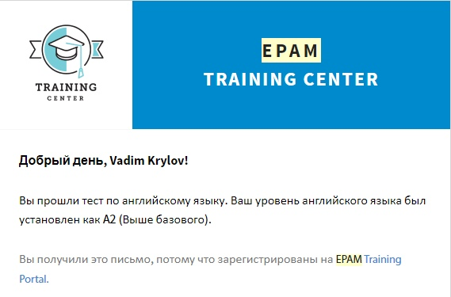

# **Vadim Krylov**

## You can contact with me using:

1. Email: vadimka.cry.00@gmail.com ;
2. Вконтакте: [click the link](https://vk.com/id140796746) ;
3. Telegram: [click the link](https://t.me/Finsoy) ;

## About myself:

I am a student of Francis Skorina State University and my specialty is computer physics. I like to creating web-sites and working with it's components. And the **JavaScript** language is ideal for this. Thanks to it, I can create whatever comes into my head. At this stage, I don't have much experience. I created a couple of sites, examples of which you can see on my [github account](https://github.com/Finsoy). I like to learn new (for me) possibilities of the language and immediately use them in practice.

## My skills:

1. HTML
2. CSS
3. JS
4. Git/GitHub
5. Desire to learn (100%)

- Also at the university I came across such programming languages as: Java, C++/C#, Delphi, Pascal;
- Familiar with the basics of OOP;
- Communicative.

## Example of my code:

```javascript
const menuButton = document.querySelector('.m-menu')
const menu = document.querySelector('.menu-sidebar')
menuButton.addEventListener('click', function () {
  menu.classList.toggle('active')
})
```

## My english level (based on test results):


